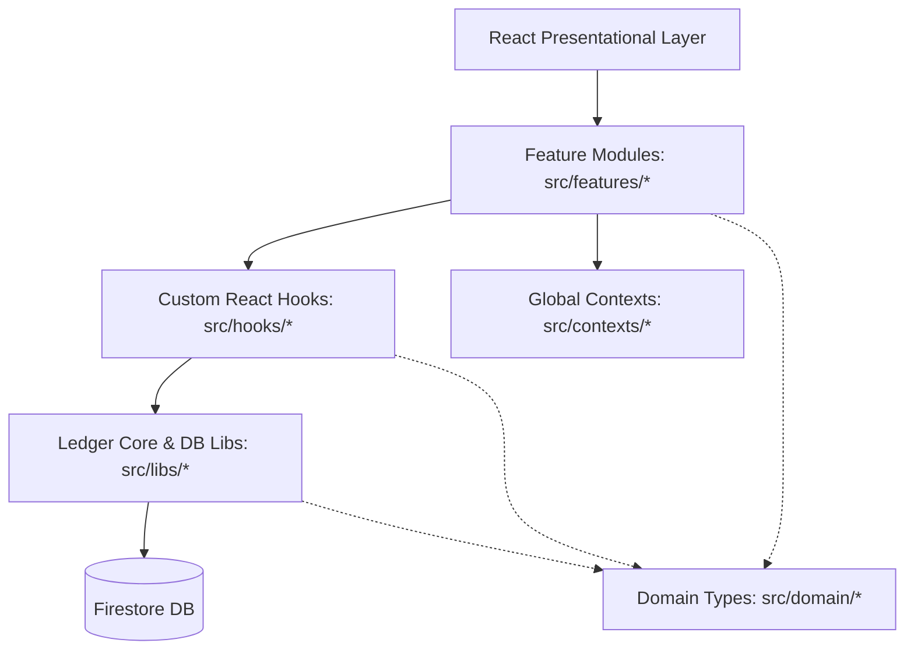

# Kippa Application Architecture & Folder Structure

This document outlines the architectural approach and folder structure of the Kippa application.

---

## 1. Architectural Approach

Kippa is designed as a **hybrid Feature-First (Feature-Oriented)** application built around a **Double-Entry Ledger Core**.



### Key Architectural Pillars:
1. **Ledger-First Principle**: Account balances, cycle metrics, and daily spend calculations are not stored as primary data; they are dynamically computed (derived) from raw, double-entry ledger records (`ledgerLines` and `transactions`).
2. **Feature-Oriented Layer**: Page views and domain-specific UI components are grouped into self-contained feature directories in `src/features/`.
3. **Decoupled Business Logic**: Low-level database mutations and calculations (e.g., closing cycles, recording double-entry transaction splits, validating carry-overs) are defined in plain TypeScript libraries in `src/libs/` and wrapped in React Query hooks in `src/hooks/useFinance.ts`.

---

## 2. Directory Structure

Below is the directory mapping for the workspace:

```text
kippa/
├── docs/                      # Architectural documents, calculations, and specifications
├── public/                    # Static assets, icons, and PWA manifest logo files
├── src/
│   ├── config/                # Global SDK configurations (e.g., Firebase client setup)
│   ├── contexts/              # Global React contexts for application state (e.g., AppContext)
│   ├── domain/                # Pure TypeScript domain models and interface types
│   ├── hooks/                 # Reusable custom React hooks and React Query queries/mutations
│   ├── libs/                  # Core double-entry services, calculators, and API helpers
│   ├── features/              # Feature modules (isolated folders containing views/components)
│   │   ├── accounts/          # Account creation and listing views
│   │   ├── activity/          # Audit logs and action feeds (with notification bell)
│   │   ├── auth/              # Sign-in/registration screen and household invitation onboarding
│   │   ├── budget-cycles/     # Budget period status dashboard and category allocation config
│   │   ├── categories/        # Expense/Income category management list
│   │   ├── dashboard/         # Landing home view integrating multi-component metrics & cards
│   │   ├── fast-entry/        # Mobile-optimized high-speed expense recorder (under 10s flow)
│   │   ├── household/         # Couple-sharing configurations and household setups
│   │   ├── notifications/     # User reminder and warning preference settings
│   │   ├── reconciliation/    # Balance drift verification interface (calculated vs. actual)
│   │   ├── shared/            # Common UI utilities, layout components, and system constants
│   │   └── transactions/      # Historical transaction ledger search, filters, edits, and voiding
│   ├── theme.ts               # Material UI theme setup (Teal-oriented design tokens)
│   ├── main.tsx               # Application bootstrap entrypoint
│   └── App.tsx                # Layout shell, tab routing, and navigation
```

---

## 3. Detailed Component Responsibilities

### `src/domain/`
All pure domain entities are declared in `src/domain/financeTypes.ts`. These represent the exact schema structure stored in Firestore:
- `FinanceTransaction`: Represents the transactional event.
- `LedgerLine`: Double-entry record for balance sheets.
- `BudgetCycle`: Period representing the salary duration.
- `BudgetAllocation`: Category allocations per cycle.

### `src/libs/`
This folder contains framework-agnostic business logic. **No UI components belong here.**
- [auth.ts](file:///Users/mustafabahaa/Work/Github/kippa/src/libs/auth.ts): Sign-in and onboarding operations.
- [db.ts](file:///Users/mustafabahaa/Work/Github/kippa/src/libs/db.ts): Raw Firestore client collection references.
- [transactions.ts](file:///Users/mustafabahaa/Work/Github/kippa/src/libs/transactions.ts): Creation, updation, and voiding of transactions. Writes must be atomic (transaction or batch writes) keeping the double-entry balance equal.
- [ledger.ts](file:///Users/mustafabahaa/Work/Github/kippa/src/libs/ledger.ts): Ledger line creations and balance consistency controls.
- [cycles.ts](file:///Users/mustafabahaa/Work/Github/kippa/src/libs/cycles.ts): Closing or rolling cycles over.
- [selectors.ts](file:///Users/mustafabahaa/Work/Github/kippa/src/libs/selectors.ts): Pure calculation functions (e.g. calculating balances, cycle progress, or safe spending rates) from arrays of transactions/ledger lines.

### `src/hooks/`
Ties the UI components to our business services using React state or React Query:
- [useFinance.ts](file:///Users/mustafabahaa/Work/Github/kippa/src/hooks/useFinance.ts): Manages all server queries and mutation caching (accounts, categories, transactions, budget allocations).

### `src/features/`
Feature-specific components:
- If a component is only used within a single feature (e.g. `BudgetPulseCard` inside the `dashboard`), it must live within that feature's directory (e.g. `src/features/dashboard/components/`).
- If a component is reused across multiple features (e.g., custom loaders, special info icons, page headers), it must live in `src/features/shared/components/`. Single-file components can be placed directly in this folder. Components containing multiple related files (such as subcomponents, styles, or configuration) should be grouped inside their own subfolders under `src/features/shared/components/` (e.g. `src/features/shared/components/DotGrid/`).

---

## 4. Coding & Design Guidelines

1. **Keep Presentational Components Dumb**: Presentational UI components should read data from React Contexts or standard Custom Hooks. Keep arithmetic financial operations in `src/libs/selectors.ts` rather than inside JSX.
2. **Atomic Writes**: When updating or voiding transactions, ensure updates are atomic via batches so that `ledgerLines` and `transactions` never drift out of sync.
3. **No Direct Firestore Reads/Writes in UI**: Never write `setDoc` or `addDoc` calls directly in UI components. Wrap them in a lib service, then reference it through `useFinance` mutations.
