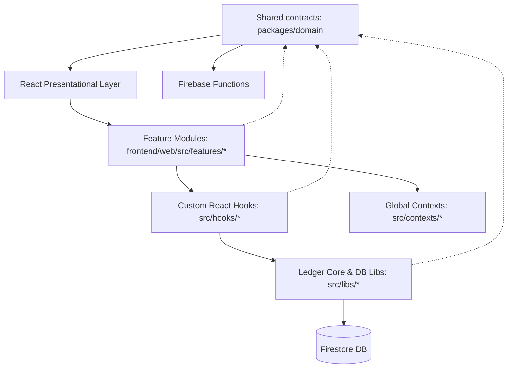

# Kippa Application Architecture & Folder Structure

This document outlines the architectural approach and folder structure of the Kippa application.

---

## 1. Architectural Approach

Kippa is a feature-oriented monorepo built around a shared domain contract and a double-entry ledger core.


```mermaid
graph TD
    Shared[Shared contracts: packages/domain] --> UI
    Shared --> Functions[Firebase Functions]
    UI[React Presentational Layer] --> Features[Feature Modules: frontend/web/src/features/*]
    Features --> Hooks[Custom React Hooks: src/hooks/*]
    Features --> Contexts[Global Contexts: src/contexts/*]
    Hooks --> Libs[Ledger Core & DB Libs: src/libs/*]
    Libs --> DB[(Firestore DB)]
    Features & Hooks & Libs -.-> Shared
```

### Key Architectural Pillars:
1. **Ledger-First Principle**: Account balances, cycle metrics, and daily spend calculations are not stored as primary data; they are dynamically computed (derived) from raw, double-entry ledger records (`ledgerLines` and `transactions`).
2. **Feature-Oriented Layer**: Page views and domain-specific UI components are grouped into self-contained feature directories in `src/features/`.
3. **Decoupled Business Logic**: Low-level database mutations and calculations (e.g., closing cycles, recording double-entry transaction splits, validating carry-overs) are defined in plain TypeScript libraries in `src/libs/` and wrapped in React Query hooks in `src/hooks/useFinance.ts`.

---

## 2. Directory Structure

Below is the directory mapping for the workspace:

```text
kippa/
├── frontend/
│   └── web/
│       └── src/
│           ├── config/        # Global SDK configurations
│           ├── contexts/      # Global React contexts
│           ├── hooks/         # React Query queries and mutations
│           ├── libs/          # Ledger services, calculators, and API helpers
│           ├── features/      # Feature modules and their views/components
│           ├── theme.ts       # Material UI theme setup
│           ├── main.tsx       # Application bootstrap entrypoint
│           └── App.tsx        # Layout shell, routing, and navigation
├── backend/
│   └── functions/
│       └── src/
│           ├── domain/        # Pure server-side rules; never imports Firebase
│           ├── features/      # Firebase handlers grouped by product feature
│           ├── libs/          # Firebase-backed infrastructure adapters
│           └── index.ts       # Stable deployed function exports
└── packages/
    └── domain/                # Type-only contracts shared across runtimes
```

---

## 3. Detailed Component Responsibilities

### `packages/domain/`
Canonical entities are declared in `packages/domain/src/index.d.ts`. Both the app and Functions import these contracts through `@kippa/domain`, preventing schema copies from drifting:
- `FinanceTransaction`: Represents the transactional event.
- `LedgerLine`: Double-entry record for balance sheets.
- `BudgetCycle`: Period representing the salary duration.
- `BudgetAllocation`: Category allocations per cycle.

### `frontend/web/src/libs/`
This folder contains framework-agnostic business logic. **No UI components belong here.**
- `auth.ts`: Sign-in and onboarding operations.
- `db.ts`: Raw Firestore client collection references.
- `transactions.ts`: Atomic creation, updating, and voiding of transactions.
- `ledger.ts`: Ledger-line creation and balance consistency controls.
- `cycles.ts`: Closing or rolling cycles over.
- `selectors.ts`: Pure balance, progress, and spending calculations.

### `frontend/web/src/hooks/`
Ties the UI components to our business services using React state or React Query:
- `useFinance.ts`: Manages server queries and mutation caching.

### `frontend/web/src/features/`
Feature-specific components:
- If a component is only used within a single feature (e.g. `BudgetPulseCard` inside the `dashboard`), it must live within that feature's directory (e.g. `src/features/dashboard/components/`).
- If a component is reused across multiple features (e.g., custom loaders, special info icons, page headers), it must live in `src/features/shared/components/`. Single-file components can be placed directly in this folder. Components containing multiple related files (such as subcomponents, styles, or configuration) should be grouped inside their own subfolders under `src/features/shared/components/` (e.g. `src/features/shared/components/DotGrid/`).

### `backend/functions/src/`
- `domain/` contains deterministic parsing, formatting, warning, date, and payload rules. It must not import Firebase.
- `features/` contains callable, HTTP, scheduled, and Firestore handlers grouped by business feature.
- `libs/` contains Firebase Admin integrations such as FCM token lookup, delivery, and cleanup.
- `index.ts` is the deployment boundary. Export names here are public Cloud Function names and must remain stable during internal refactors.

---

## 4. Coding & Design Guidelines

1. **Keep Presentational Components Dumb**: Presentational UI components should read data from React Contexts or standard Custom Hooks. Keep arithmetic financial operations in `src/libs/selectors.ts` rather than inside JSX.
2. **Atomic Writes**: When updating or voiding transactions, ensure updates are atomic via batches so that `ledgerLines` and `transactions` never drift out of sync.
3. **No Direct Firestore Reads/Writes in UI**: Never write `setDoc` or `addDoc` calls directly in UI components. Wrap them in a lib service, then reference it through `useFinance` mutations.
